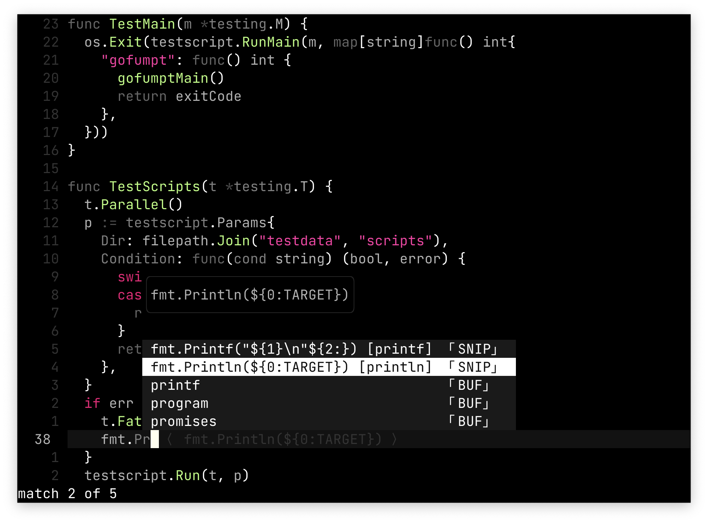
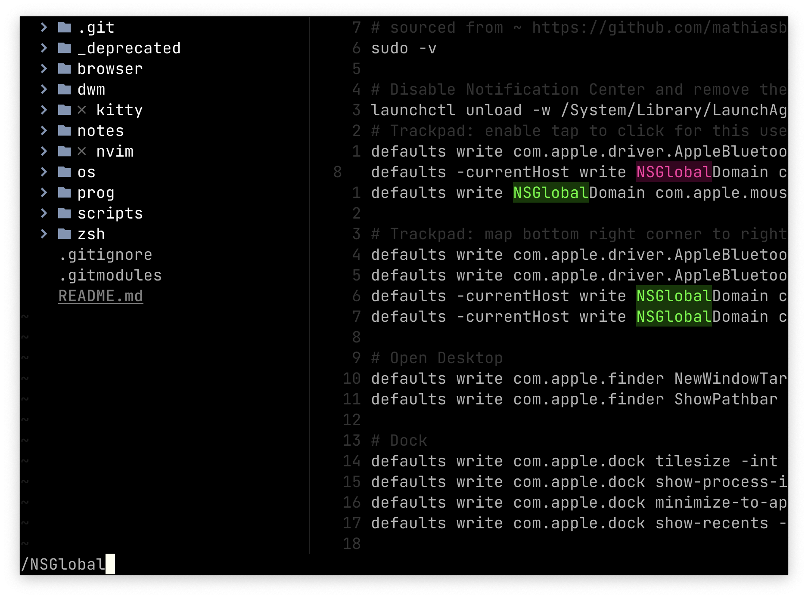
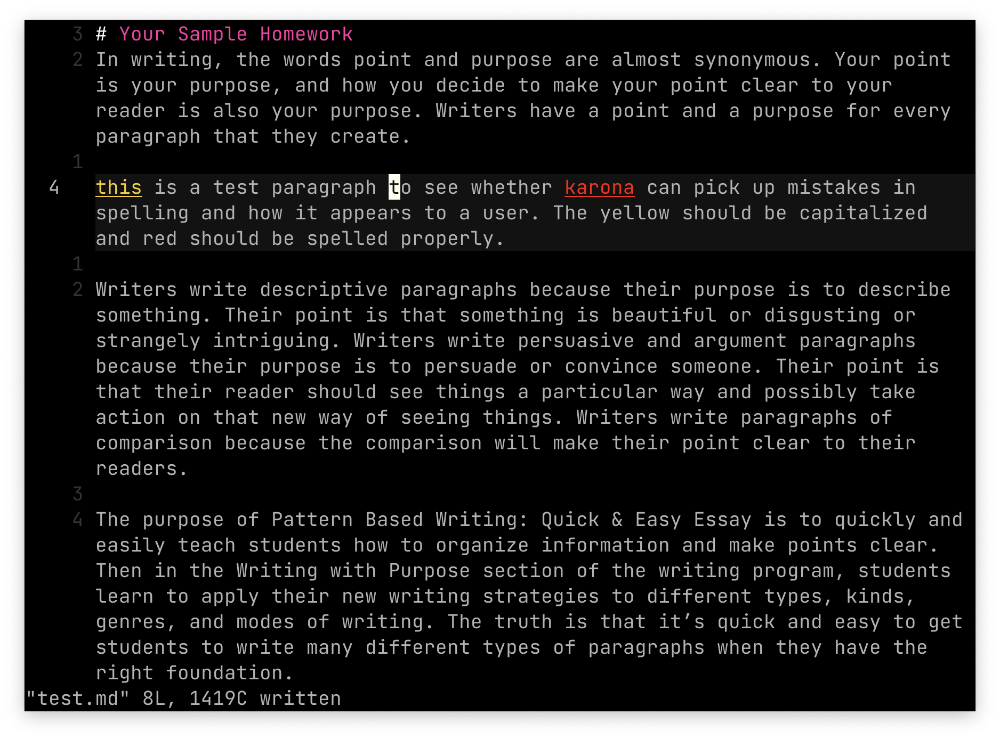
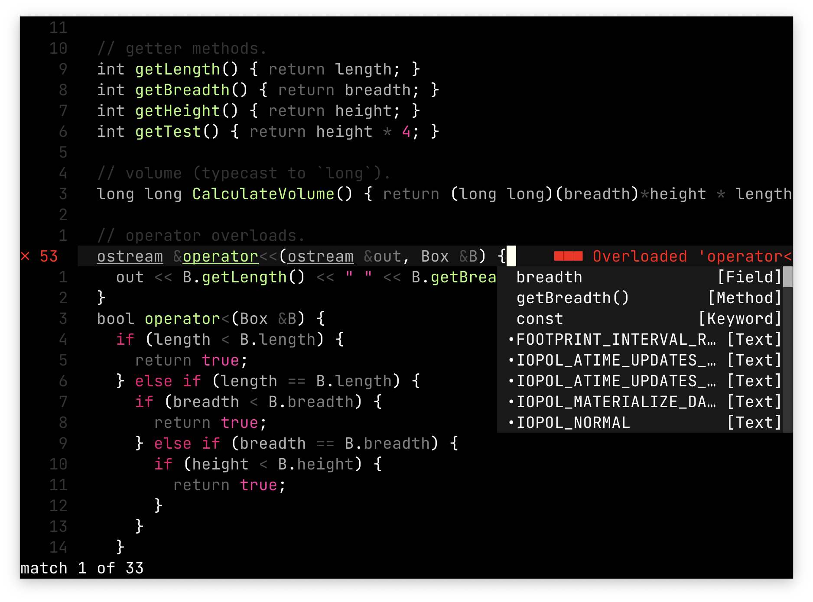

🍒 Karonda 🍉
===

<details><summary>Click for Pictures!</summary>




</details>

### Supported Plugins

[nvim-treesitter](https://github.com/nvim-treesitter/nvim-treesitter)  
[telescope.nvim](https://github.com/nvim-telescope/telescope.nvim)

> Support coming for `LspSaga`, and feel free to suggest more by writing an issue.

## Installation & Usage

```
Plug 'astrlux/karonda' " vimscript w/ VimPlug 
use 'astrlux/karonda' -- lua w/ packer
```
```vim
" Vimscript
set termguicolors
colorscheme karonda
```
```lua
-- Lua
vim.opt.termguicolors = true
vim.cmd 'colorscheme karonda'
```
