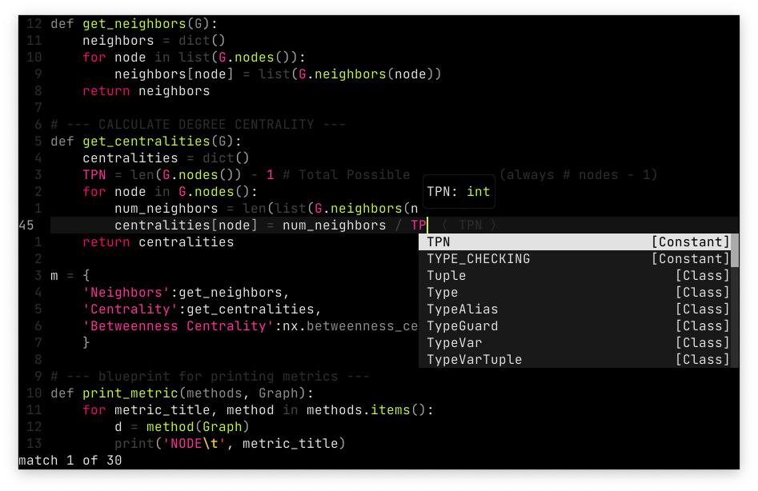
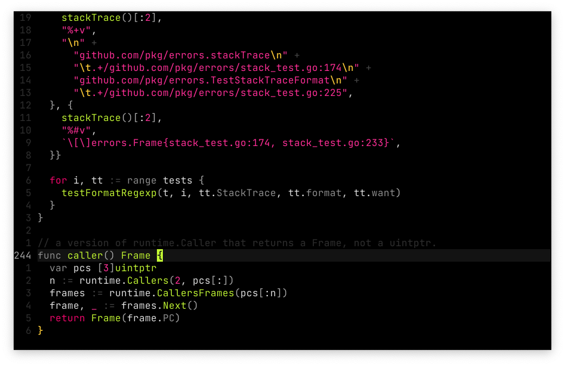
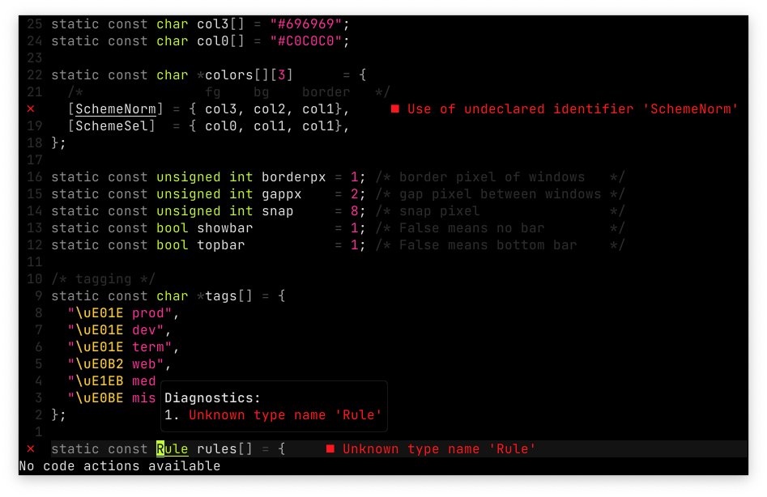
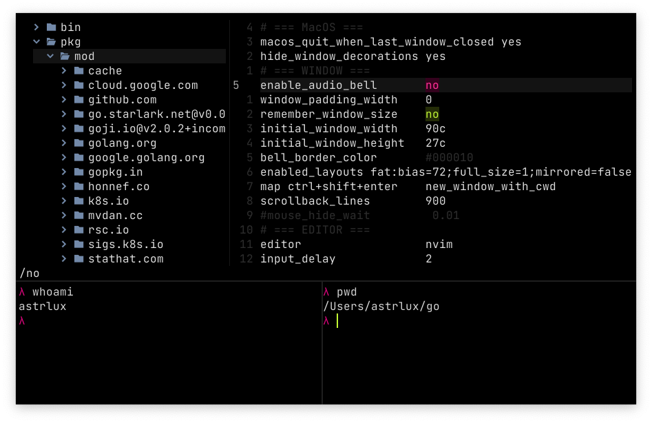
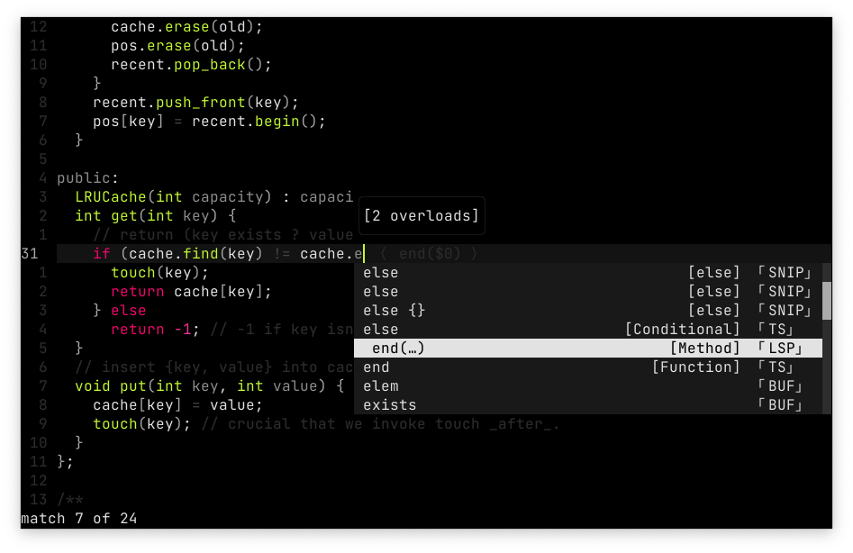

<p align="center">

</p>

<details><summary>Click for Pictures!</summary>






</details>

### Supported Plugins

- [x] [nvim-treesitter](https://github.com/nvim-treesitter/nvim-treesitter)  
- [x] [telescope.nvim](https://github.com/nvim-telescope/telescope.nvim)
- [x] [nvim-tree.lua](https://github.com/kyazdani42/nvim-tree.lua) 
- [x] [coq_nvim](https://github.com/ms-jpq/coq_nvim)
- [x] [nvim-cmp](https://github.com/hrsh7th/nvim-cmp)
- [ ] [lspsaga.nvim](https://github.com/glepnir/lspsaga.nvim)
- [ ] [lualine.nvim](https://github.com/nvim-lualine/lualine.nvim)
- [ ] [vim-fugitive](https://github.com/tpope/vim-fugitive)
- [ ] [which-key.nvim](https://github.com/folke/which-key.nvim)

You're welcome to request more plugins.

### Install & Use

```lua
use { -- INSTALL
  'astrlux/karonda.nvim',
  requires = { 'rktjmp/lush.nvim' }
}
vim.opt.termguicolors = true 
vim.cmd 'colorscheme karonda' -- USE
```
